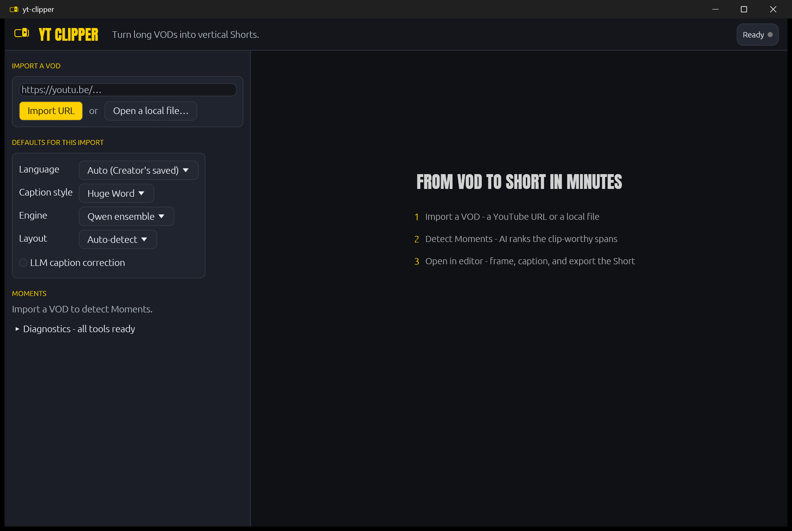
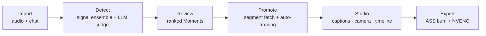

<p align="center">
  <picture>
    <source media="(prefers-color-scheme: dark)" srcset="assets/branding/logo.svg">
    
  </picture>
</p>

<h1 align="center">YT&nbsp;CLIPPER</h1>

<p align="center"><em>Turn long VODs into vertical Shorts — entirely on your machine.</em></p>

<p align="center">
  
  
  
  
</p>

Windows-first desktop app that turns long VODs — gaming streams and podcasts — into vertical (9:16) short-form clips: transcription, moment detection, framing, speaker tracking, animated captions, and NVENC export, with zero cloud calls. Pure Rust (egui), no web stack.

<p align="center">
  
</p>

## What it does

- **Finds the Moments.** A heuristic ensemble (chat-replay spikes, loudness, speech-emotion arousal, excitement lexicon) plus a local LLM judge scores candidate Moments across the whole VOD; every signal stays inspectable per Moment. Detected clips start and end on sentence boundaries, aiming for 45–180 s of real speech.
- **Titles that know the video.** The judge first writes itself a whole-video brief, then titles every Moment with that context — catchy, in the VOD's own language, never a dead topic label.
- **Opens a Studio, not a dialog.** Promoting a Moment opens a full-window editor: editable transcript (burned verbatim), Before/After preview with a WYSIWYG caption overlay, drag/resize caption placement, camera and framing tools, and a multi-track timeline — video filmstrip, two caption lanes (AI's and yours), a music track, a thumbnail intro, a timeline razor, edge fades, undo/redo.
- **Cuts podcasts like an editor.** Podcast Mode tracks every visible face, attributes speech per time bin (mouth motion fused with voice-print diarization), and derives a cut-based Active-Speaker camera plan — solo shots, split-screen group shots, no amateur panning. Every plan passes a camera audit before render.
- **Captions like a human typed them.** whisper large-v3 (CUDA) or the Qwen3-ASR five-variant ensemble with forced-alignment timing, per-Creator dialect stores that learn a streamer's slang and viewer names, a self-populating review queue, and an optional local-LLM correction pass.
- **Renders once, fast.** ffmpeg filtergraph + ASS subtitles + NVENC; karaoke, huge-word, and rolling caption styles in the bundled Anton face; caption presets from Classic to MrBeast.
- **Heals itself offline-first.** The Diagnostics registry lists every tool and model the pipeline resolves; anything missing downloads in-app from its pinned official source, SHA-256-verified. Anything optional that's absent degrades gracefully instead of failing. The only network uses are user-initiated: ingesting a VOD and fetching a missing dependency.

## How it works



Ingest is audio-first and two-phase: importing a VOD downloads only its audio and chat replay; full-quality video is fetched per clip, only when a Moment is promoted. Analysis and rendering share one GPU, staged strictly sequentially — transcription unloads before the judge loads.

## Getting started

Prerequisites (Windows, MSVC):

- Rust (MSVC toolchain), CMake, and the **CUDA Toolkit** — whisper.cpp's CUDA backend is compiled from source (verified against CUDA 13.3, compute 8.6).
- **LLVM**, for `libclang` — whisper-rs runs `bindgen` at build time, and its bundled bindings are Linux-only, so a Windows build must generate its own. Install with `winget install LLVM.LLVM`; the build looks for `libclang.dll` (set `LIBCLANG_PATH` if it lands somewhere non-standard). Do **not** set `WHISPER_DONT_GENERATE_BINDINGS` on Windows — the bundled bindings won't compile here.
- An NVIDIA GPU.

Build through the env wrapper, which discovers VS, CUDA, and LLVM for you:

```powershell
# development run
scripts\cargo-cuda.bat run -p yt-clipper

# production release build (app + LLM-judge sidecar, with the face/align/ser features)
scripts\build-release.bat
```

Fetch the pinned tools and models — either from inside the app (**Diagnostics → Download**, pinned official sources, SHA-256-verified) or ahead of time:

```powershell
powershell -ExecutionPolicy Bypass -File scripts/fetch-sidecars.ps1      # ffmpeg, yt-dlp, deno, deep-filter
powershell -ExecutionPolicy Bypass -File scripts/fetch-models.ps1        # whisper large-v3 (~3.1 GB), Silero VAD, Qwen3-ASR
powershell -ExecutionPolicy Bypass -File scripts/fetch-llama-sidecar.ps1 # pinned llama.cpp (ensemble decoder)
```

Model files live in `/models`, sidecar binaries in `/sidecars`, bundled fonts + the brand set in `/assets`, per-VOD working data in `/workspace` (all gitignored except `/assets`).

Then: paste a YouTube URL (or open a local file) → **Detect Moments** → review the ranked list by ear → **Open in editor** → Export. The full workflow, editor tour, and dependency table are in the **[User Guide](docs/USER-GUIDE.md)**.

## Headless CLI

Every pipeline stage also drives without the GUI (same worker, same code path):

```powershell
# one clip, end to end: import -> transcribe -> frame -> caption -> NVENC
yt-clipper --headless <url-or-file> <start_s> <end_s> [en|id|ja] [huge|rolling|karaoke] [auto|stacked|cam|gameplay]

# detection only: ranked Moments with per-signal scores + generated titles
yt-clipper --detect <url-or-file> [en|id|ja]

# batch: import -> detect -> render the top-k Moments, sequentially
yt-clipper --batch <url-or-file> [en|id|ja] [huge|rolling|karaoke] [k] [auto|stacked|cam|gameplay]
```

Configuration knobs (`YC_MAX_CLIP_S`, `YC_QWEN_ENS`, `YC_FORCED_ALIGN`, …) are documented in the [User Guide](docs/USER-GUIDE.md#environment-variables).

## Build features

The default build needs no ONNX Runtime binary; each feature compiles one optional capability in (release builds ship `face,align,ser`):

| Feature   | Adds                                                                                        |
| --------- | ------------------------------------------------------------------------------------------- |
| `face`    | Facecam auto-detect framing + podcast speaker tracking (Ultraface, CAM++, YuNet, SFace)      |
| `ser`     | The arousal Signal — a CPU speech-emotion model that demotes loud-but-flat moments           |
| `align`   | wav2vec2-CTC forced-alignment caption timing (the ensemble engine's default skeleton)        |
| `enh`     | Cleaned-voice captions — DeepFilterNet denoise of the caption input (never the export audio) |
| `correct` | The LLM caption-correction pass (context-sensitive slang/name repair, opt-in per render)     |
| `sep`     | htdemucs vocal-stem separation (experimental; rejected for captions, kept for research)      |

## Documentation

- **[User Guide](docs/USER-GUIDE.md)** — install, first Short, the Studio editor, caption engines, CLI + env reference, troubleshooting.
- **[Architecture](docs/ARCHITECTURE.md)** — crate map, process model, GPU staging, data layout, design principles.
- **[CONTEXT.md](CONTEXT.md)** — the domain language. Code mirrors these terms exactly.
- **[docs/adr/](docs/adr/)** — 71 architecture decision records: why everything is the way it is (read 0001 first).
- **[docs/ROADMAP.md](docs/ROADMAP.md)** — how it was built, milestone by milestone.

## Built with

[whisper.cpp](https://github.com/ggml-org/whisper.cpp) · [llama.cpp](https://github.com/ggml-org/llama.cpp) · [Qwen](https://github.com/QwenLM) (2.5-Instruct judge, 3-ASR ensemble) · [egui](https://github.com/emilk/egui)/eframe · [ffmpeg](https://ffmpeg.org) · [yt-dlp](https://github.com/yt-dlp/yt-dlp) · [ONNX Runtime](https://onnxruntime.ai) via [ort](https://github.com/pykeio/ort) · [DeepFilterNet](https://github.com/Rikorose/DeepFilterNet) · [Silero VAD](https://github.com/snakers4/silero-vad) · audeering w2v2 speech-emotion · 3D-Speaker CAM++ · sherpa-onnx audio tagging

## License

[MIT](LICENSE). Clip responsibly: only process VODs you have the rights (or the Creator's permission) to republish.
